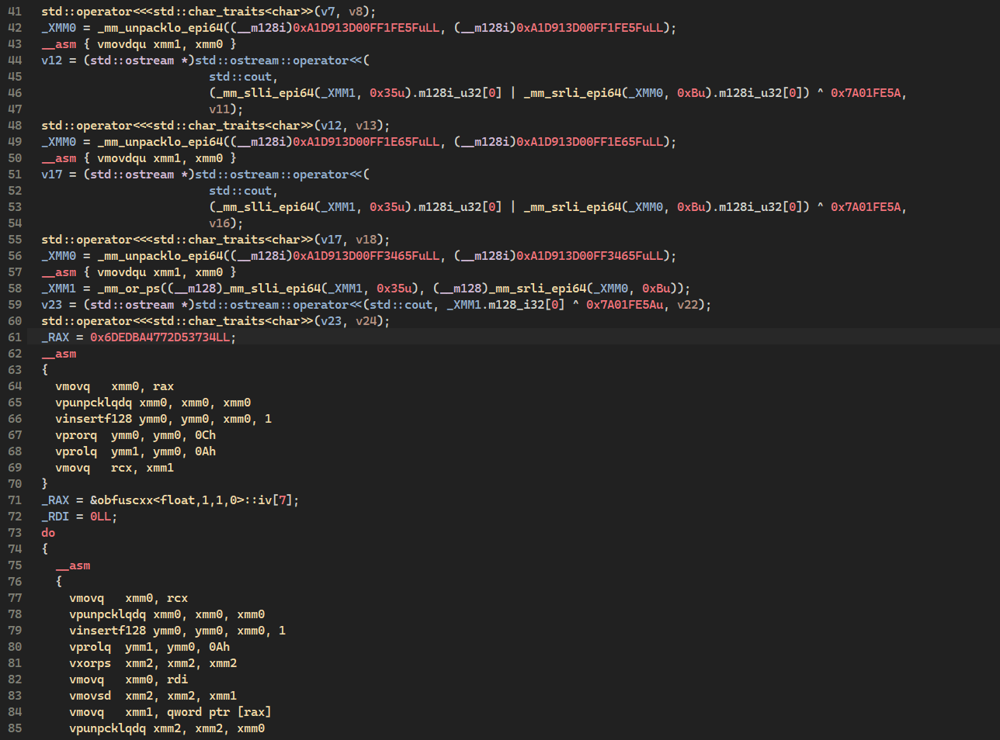
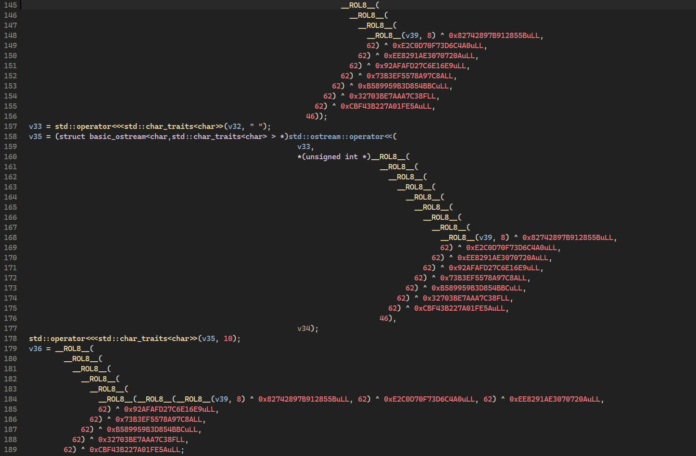

# obfuscxx

## Description:
Header-only compile-time variables obfuscation library for C++20 and later.

## How it works:
During compilation, data is encrypted via bitwise XOR combined with ROL/ROR procedures. Decryption uses SIMD instructions (AVX/SSE) at runtime, making static analysis considerably more complicated. Key entropy is based on the preprocessor macro `__COUNTER__`, the file name(`__FILE__`), and the line number (`__LINE__`) where the variable is defined.

By selecting different encryption levels (Low, High), you can apply a simpler algorithm to data that is sensitive to execution speed. It’s also possible to specify custom entropy for individual variables.

## Encryption example:
The screenshots show only a small portion of the int main() function. In reality, the function can grow to around 250 lines depending on the compiler.

<div align="center">
  
  <p><em>MSVC (High-Level)</em></p>
</div>

<div align="center">
  
  <p><em>LLVM (High-Level)</em></p>
</div>

## Installation:
Just add the header file to your project - `#include "include/obfuscxx.h"`

## Usage:
```cpp
#include "obfuscxx.h"

obfuscxx<int, 1, obf_level::Low> int_value{ 100 };
std::cout << int_value.get() << '\n'; // 100

int_value = 50;
std::cout << int_value.get() << '\n'; // 50

obfuscxx<float> float_value{ 1.5f };
std::cout << float_value.get() << '\n'; // 1.5f

obfuscxx<int, 4> array{ 1, 2, 3, 4 };
for (auto val : array) {
    std::cout << val << " "; // 1 2 3 4
}
std::cout << '\n';

obfuscxx<int*> pointer{};
pointer.set(new int{101});
std::cout << pointer.get() << " " << *pointer.get() << '\n'; // ptr, 101
delete pointer.get();
```

## Compiler Support:
- `MSVC (+wdm)`
- `CLANG`
- `GCC`