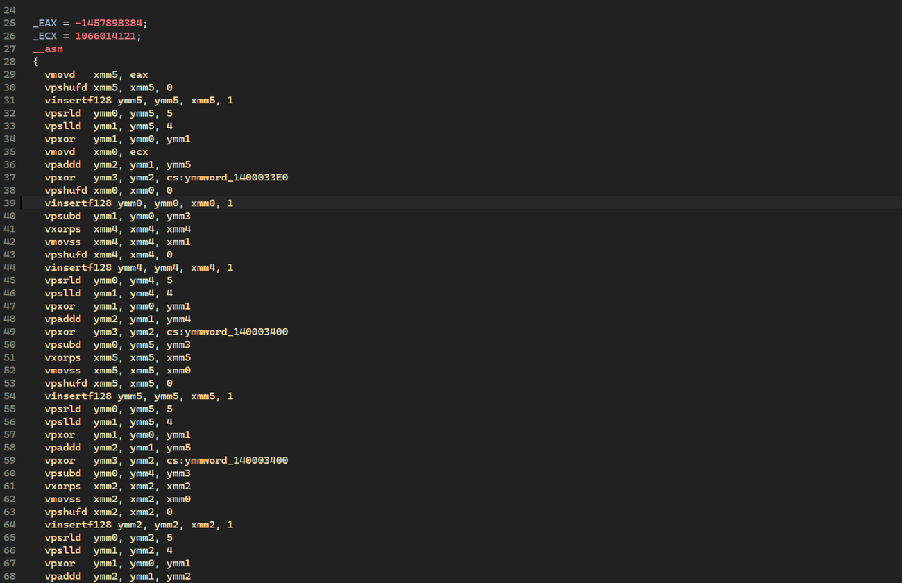
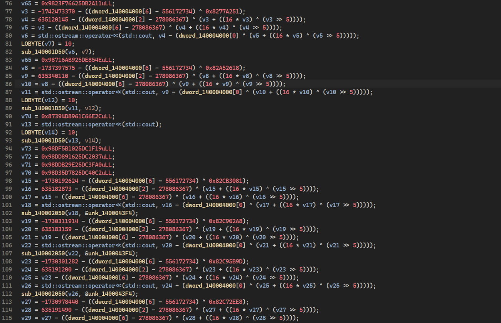

# obfuscxx

## Description:
Header-only compile-time variables obfuscation library for C++20 and later.

## How it works:
During compilation, data is encrypted via eXtended Tiny Encryption Algorithm (XTEA). Decryption uses SIMD instructions (AVX/SSE/NEON) at runtime, making static analysis considerably more complicated. Key entropy is based on the preprocessor macro `__COUNTER__`, the file name(`__FILE__`), and the line number (`__LINE__`) where the variable is defined, and the build time (`__TIME__`) (note: build time is not included when compiling with WDM).

By selecting different encryption levels (Low, Medium, High), you can control the number of encryption rounds. With Low, there are 2 rounds; Medium uses 6; and High adjusts the number of rounds dynamically based on the key entropy, ranging from 6 to 20. This lets you apply lighter encryption to frequently accessed data, and stronger encryption to data that’s used less often.

## Encryption example:
The screenshots show only a small portion of the int main() function. In reality, the function can grow to around 250 lines depending on the compiler.

<table align="center">
<tr>
<td></td>
<td></td>
<td></td>
</tr>
</table>
<p align="center"><em>MSVC, LLVM, GCC compilation (int main()) (Level: Low)</em></p>

## Performance Impact:

### Runtime Performance:
Benchmark results (1M iterations):

| Compiler | Normal           | Obfuscated       | Overhead      |
|:---------|:-----------------|:-----------------|:--------------|
| **MSVC** | 347 μs           | 4,437 μs         | +4,090 μs (**~12.8x**) |
| **LLVM** | 174 μs           | 3,613 μs         | +3,439 μs (**~20.8x**) |
| **GCC**  | 97 μs            | 2,911 μs         | +2,814 μs (**~30.0x**) |

**Per-decryption cost:** ~3-4 nanoseconds

### Encryption Levels Comparison:
Benchmark results (100K iterations):

| Compiler | Low              | Medium           | High          |
|:---------|:-----------------|:-----------------|:--------------|
| **MSVC** | 428 μs           | 2,228 μs (5.2x)  | 4,065 μs (9.5x) |
| **LLVM** | 285 μs           | 1,089 μs (3.8x)  | 2,858 μs (10.0x) |
| **GCC**  | 363 μs           | 1,126 μs (3.1x)  | 2,347 μs (6.5x) |

### Binary Size Overhead:
| Compiler | Without obfuscxx | With obfuscxx    | Overhead      |
|:---------|:-----------------|:-----------------|:--------------|
| **MSVC** | 17.0 KB          | 18.0 KB          | +1,024 bytes (**+5.9%**) |
| **LLVM** | 17.5 KB          | 19.6 KB          | +1,560 bytes (**+8.7%**) |
| **GCC**  | 47.8 KB          | 52.2 KB          | +4,491 bytes (**+9.2%**) |

## Installation:
Just add the header file to your project - `#include "include/obfuscxx.h"`

## Usage:
```cpp
#include "include/obfuscxx.h"

int main()
{
    obfuscxx<int> int_value{ 100 };
    std::cout << int_value.get() << '\n';
    int_value = 50;
    std::cout << int_value.get() << '\n';

    obfuscxx<float> float_value{ 1.5f };
    std::cout << float_value.get() << '\n';

    obfuscxx<int, 4> array{ 1, 2, 3, 4 };
    for (auto val : array) {
        std::cout << val << " ";
    }
    std::cout << '\n';

	obfuscxx str("str");
    std::cout << str.to_string() << '\n';

    obfuscxx<int*> pointer{};
    pointer = new int{101};
    std::cout << pointer.get() << " " << *pointer.get() << '\n';
    delete pointer.get();
}
```

## Compiler Support:
- `MSVC (+wdm)`
- `CLANG`
- `GCC`

## Architecture Support:
- `x86-64`
- `ARM`
